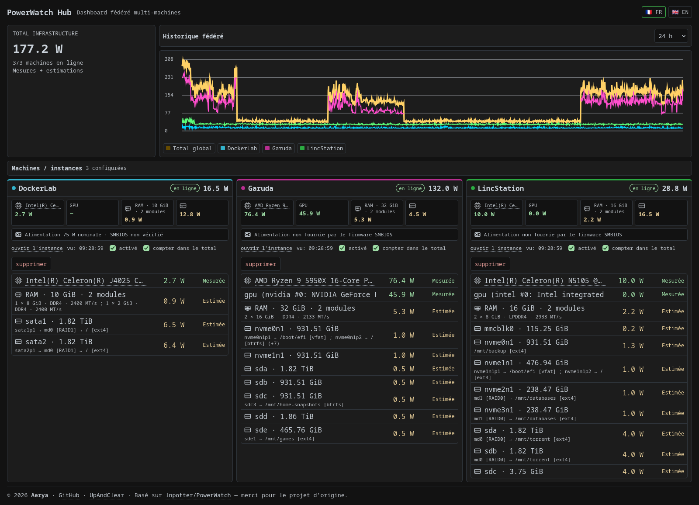
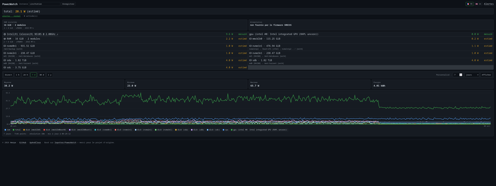
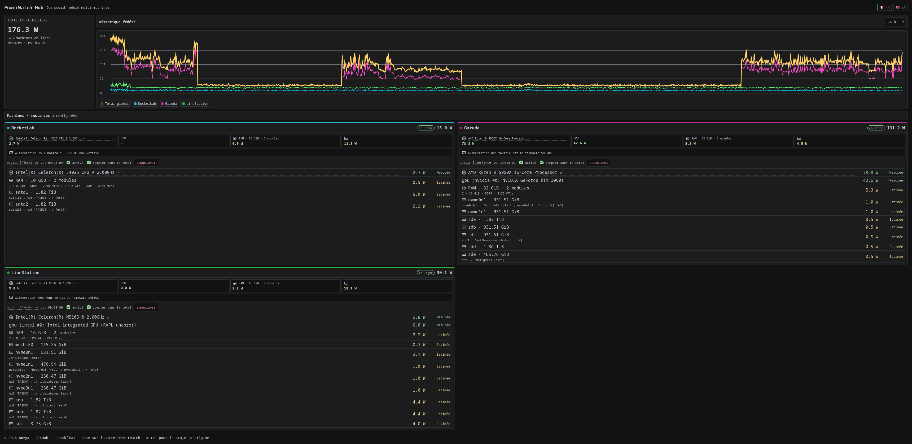

# PowerWatch

<p align="center">
  
</p>

<p align="center">
  <strong>Français</strong> · <a href="README.en.md">English</a>
</p>

<p align="center">
  
</p>

<p align="center">
  <em>PowerWatch Hub centralise la consommation de plusieurs machines dans un seul dashboard.</em>
</p>

## Sommaire

- [Fonctionnalités](#fonctionnalités)
- [Mesures](#mesures)
  - [RAM et alimentation](#ram-et-alimentation)
- [Installation Docker](#installation-docker)
  - [Prérequis](#prérequis)
  - [Démarrage rapide](#démarrage-rapide)
  - [CPU RAPL via MSR](#cpu-rapl-via-msr--synology-dsm-et-noyaux-sans-powercap)
- [Compilation native](#compilation-native)
- [GPU](#gpu)
  - [AMD](#amd)
  - [Intel](#intel)
  - [NVIDIA](#nvidia)
- [Disques, partitions et stockage](#disques-partitions-et-stockage)
- [WebUI](#webui)
- [Historique](#historique)
- [Alertes et notifications](#alertes-et-notifications)
- [Authentification intégrée](#authentification-intégrée)
- [CLI et TUI dans Docker](#cli-et-tui-dans-docker)
- [Vérifier les capteurs détectés](#vérifier-les-capteurs-détectés)
- [PowerWatch Hub](#powerwatch-hub--plusieurs-machines-un-seul-dashboard)
  - [Démarrage du Hub](#démarrage-du-hub)
- [Sécurité](#sécurité)
- [Attribution](#attribution)
- [Licence](#licence)

**PowerWatch** surveille la consommation électrique d'une machine Linux depuis Docker et l'affiche dans une WebUI, avec historique, alertes et plusieurs sources matérielles réelles ou estimées.

Ce fork est pensé en priorité pour les **serveurs, mini-PC, machines desktop Linux et hôtes Docker**. **Docker reste la méthode de déploiement recommandée et la mieux maîtrisée** ; une compilation native depuis les sources est également documentée pour les utilisateurs avancés.

> **Sécurité :** l'authentification intégrée est facultative et désactivée par défaut. Sans elle, utilisez la WebUI uniquement sur un **LAN privé de confiance**.

## Fonctionnalités

- WebUI temps réel avec vue historique.
- Historique SQLite persistant avec agrégation longue durée.
- Alertes configurables depuis la WebUI.
- Notifications **Discord** et **Apprise API**.
- Détection multi-GPU **NVIDIA / AMD / Intel**.
- Fallback **Intel RAPL `uncore`** pour certains iGPU sans compteur i915/xe hwmon.
- Fallback CPU **RAPL via `/dev/cpu/0/msr`** lorsque le noyau n'expose pas `powercap` (notamment certains Synology DSM).
- Suivi de tous les **disques physiques** sans double comptage RAID/LVM, avec affichage de leur capacité.
- Affichage best-effort des **partitions montées, systèmes de fichiers, mdraid, LVM et dm-crypt** liés aux disques, sans bruit provenant des partitions non montées.
- CLI et TUI disponibles dans l'image Docker.
- Images GHCR multi-architecture **amd64 / arm64**.
- Interface Web **français / anglais**.
- Authentification WebUI facultative avec compte administrateur unique, sessions persistantes et jetons API en lecture seule.
- Nom d'instance PowerWatch configurable dans la WebUI et proposé automatiquement lors de l'ajout dans le Hub, sans empêcher un alias Hub différent.
- Modèle CPU affiché avec lien direct vers la recherche **CPU Benchmark / PassMark** et icônes monochromes CPU/RAM/disque.
- Inventaire RAM best-effort : **capacité installée, nombre de modules occupés et détails de chaque module** via SMBIOS lorsque disponibles.
- Informations alimentation best-effort via **SMBIOS Type 39** : puissance nominale maximale, fabricant/modèle, emplacement, type et état lorsque le firmware les publie.
- **PowerWatch Hub** : agrégation de plusieurs machines dans un dashboard fédéré unique.

## Mesures

| Composant | Source | Type |
|---|---|---|
| CPU | RAPL Linux (`powercap` ou MSR `/dev/cpu/0/msr`) | Mesurée |
| GPU NVIDIA | NVML | Mesurée |
| GPU AMD | `amdgpu` hwmon | Mesurée |
| GPU Intel | `i915` / `xe` hwmon ou RAPL `uncore` | Mesurée |
| RAM | Heuristique | Estimée |
| Disques | Temps occupé (`/proc/diskstats`) + profil du média ; power states NVMe si disponibles | Estimée |
| Total | Somme des capteurs disponibles | Mixte |

Un capteur indisponible est simplement ignoré.

Sur certains Intel, PowerWatch peut utiliser le sous-domaine RAPL `uncore` comme mesure de l'iGPU. Dans ce cas, la valeur CPU est calculée à partir du package en retirant `uncore` afin de ne pas compter deux fois l'iGPU.

Lorsque l'interface Linux `powercap` est absente mais que `/dev/cpu/0/msr` existe, PowerWatch peut lire directement les registres RAPL `MSR_RAPL_POWER_UNIT` (`0x606`) et `MSR_PKG_ENERGY_STATUS` (`0x611`). Cette valeur reste une **mesure matérielle** du package CPU, pas une estimation basée sur le pourcentage d'utilisation.

### RAM et alimentation

PowerWatch complète les mesures électriques avec un petit inventaire matériel best-effort, affiché dans la WebUI locale et transmis au Hub.

Pour la **RAM** :

- la mémoire totale utilisable est lue depuis `/proc/meminfo` ;
- PowerWatch lit en priorité la table SMBIOS/DMI brute du noyau pour récupérer la capacité réellement installée et les périphériques mémoire occupés ;
- l'interface **regroupe les modules identiques** en un résumé court (ex. `2 × 16 GiB · DDR4 · 3200 MT/s`) sans afficher les longues références constructeur ou les emplacements ; les métadonnées complètes restent disponibles dans l'API ;
- le nombre affiché correspond aux **Memory Devices SMBIOS occupés**. Sur certaines machines, de la mémoire soudée peut donc apparaître comme un module même s'il ne s'agit pas physiquement d'une barrette amovible ;
- si SMBIOS est inaccessible, PowerWatch affiche la mémoire **utilisable** vue par Linux et ne la présente plus comme de la « RAM installée ».

Pour l'**alimentation** :

- PowerWatch lit SMBIOS **Type 39 / System Power Supply** ;
- les entrées génériques du firmware (`Default string`, `OEM Define`, états/types sans capacité ni identité crédible) sont masquées, ainsi que les baies explicitement absentes ;
- la WebUI et le Hub n'affichent qu'un **résumé compact**, sans répéter les watts dans la même ligne ; les détails éventuels restent accessibles en infobulle ;
- une puissance annoncée est explicitement marquée **« SMBIOS non vérifié »** : même une valeur apparemment plausible peut différer de la puissance réelle du bloc d'alimentation ;
- la valeur en watts est une **capacité nominale maximale déclarée via SMBIOS, non vérifiée physiquement**, pas sa consommation électrique instantanée ;
- cette puissance nominale n'est **jamais ajoutée** au total de consommation PowerWatch.

Docker masque normalement `/sys/firmware` dans les conteneurs. Le Compose PowerWatch monte donc explicitement le firmware de l'hôte en lecture seule sous `/host-sys-firmware` et définit `POWERWATCH_DMI_TABLE_PATH=/host-sys-firmware/dmi/tables/DMI`. PowerWatch parse directement cette table : aucun mode `privileged` ni accès à `/dev/mem` n'est nécessaire.

De nombreuses cartes mères grand public et alimentations ATX classiques ne publient aucun SMBIOS Type 39. PowerWatch distingue alors deux cas : **SMBIOS inaccessible** ou **alimentation non fournie par le firmware SMBIOS**, au lieu de laisser croire que les deux situations sont identiques. `dmidecode` reste disponible comme fallback lorsque la table brute n'est pas lisible.

## Installation Docker

### Prérequis

- Linux ;
- Docker Engine ;
- Docker Compose ;
- accès en lecture à `/sys` depuis le conteneur ;
- pour NVIDIA : pilote NVIDIA + NVIDIA Container Toolkit sur l'hôte.

### Démarrage rapide

```bash
git clone https://github.com/Aerya/PowerWatch.git
cd PowerWatch

cp .env.example .env
docker compose pull
docker compose up -d
```

Par défaut, le Compose publie la WebUI uniquement sur :

```text
127.0.0.1:3000
```

Pour l'ouvrir sur le réseau local, modifiez `.env` avec **l'adresse IPv4 privée du serveur** :

```env
POWERWATCH_BIND_IP=192.168.0.50
```

Puis relancez :

```bash
docker compose up -d
```

La WebUI sera alors disponible sur :

```text
http://192.168.0.50:3000
```

Le fichier [`compose.yaml`](compose.yaml) fourni est le fichier de déploiement de référence.

### CPU RAPL via MSR — Synology DSM et noyaux sans `powercap`

Sur certains systèmes Intel, notamment certains **Synology DSM**, le noyau n'expose pas `/sys/.../powercap` alors que le périphérique `/dev/cpu/0/msr` est disponible.

Dans ce cas, décommentez dans `compose.yaml` les deux blocs suivants :

```yaml
cap_add:
  - SYS_RAWIO

devices:
  - /dev/cpu/0/msr:/dev/cpu/0/msr:r
```

Le pilote Linux `msr` exige **`CAP_SYS_RAWIO`** pour ouvrir `/dev/cpu/*/msr`, y compris lorsque le processus du conteneur tourne en root. Il n'est pas nécessaire d'utiliser `privileged: true` : n'activez que `SYS_RAWIO` avec le device MSR lorsque ce fallback est réellement nécessaire.

PowerWatch utilise toujours `powercap` en priorité. Le MSR n'est utilisé qu'en fallback si aucun domaine RAPL `powercap` n'est découvert. Un seul device CPU est nécessaire : le compteur `MSR_PKG_ENERGY_STATUS` est **commun au package**, il ne faut donc pas additionner `/dev/cpu/0/msr` et `/dev/cpu/1/msr`.

Pour les détails matériels et Docker : [`DOCKER.md`](DOCKER.md).

## Compilation native

Docker reste la méthode de déploiement recommandée pour PowerWatch. La compilation native est destinée aux utilisateurs avancés qui souhaitent exécuter directement les binaires sur leur distribution Linux.

### Prérequis

Il faut disposer de :

- **Git** ;
- une version stable récente de **Rust** et **Cargo** ;
- une chaîne de compilation C fonctionnelle (`gcc` ou `clang`, linker, `make`, etc.).

Rust peut être installé avec la méthode officielle [`rustup`](https://rustup.rs/).

Exemples de prérequis système courants :

```bash
# Debian / Ubuntu
sudo apt install build-essential pkg-config git curl dmidecode

# Fedora
sudo dnf group install "Development Tools"
sudo dnf install git pkgconf-pkg-config curl dmidecode

# Arch Linux / Garuda
sudo pacman -S --needed base-devel git curl dmidecode
```

### Compiler PowerWatch

Clonez le dépôt puis compilez tout le workspace en mode release :

```bash
git clone https://github.com/Aerya/PowerWatch.git
cd PowerWatch
cargo build --release --workspace
```

Les quatre exécutables sont générés dans `target/release/` :

```text
powerwatch
powerwatch-tui
powerwatch-web
powerwatch-hub
```

### Lancer les binaires

CLI :

```bash
./target/release/powerwatch
./target/release/powerwatch --json
```

TUI :

```bash
./target/release/powerwatch-tui
```

WebUI locale avec historique :

```bash
./target/release/powerwatch-web   --host 127.0.0.1   --port 3000   --log   --history-interval 60
```

Pour un serveur/headless, ajoutez `--nas-mode`. L'authentification facultative s'active avec `--auth` ou `POWERWATCH_AUTH_ENABLED=true` ; sans elle, limitez une écoute LAN à un réseau privé de confiance.

Hub avec ses fichiers de configuration et d'historique dans le répertoire courant :

```bash
./target/release/powerwatch-hub   --host 127.0.0.1   --port 3065   --config ./powerwatch-hub.json   --database ./powerwatch-hub.db
```

### Accès au matériel

En natif, PowerWatch lit directement les interfaces matérielles exposées par Linux. Il n'y a donc pas de montage Docker à configurer.

- **NVIDIA** : NVIDIA Container Toolkit n'est pas nécessaire en natif. Le pilote NVIDIA/NVML doit simplement fonctionner sur l'hôte ; `nvidia-smi` permet de le vérifier.
- **AMD / Intel** : les compteurs disponibles dans `/sys` sont lus directement.
- **RAPL MSR** : si le fallback `/dev/cpu/0/msr` est nécessaire, le processus doit disposer des permissions/capabilities exigées par le noyau pour ouvrir le device, notamment `CAP_SYS_RAWIO` selon la configuration de l'hôte.

> **Support :** la compilation native est fournie comme possibilité avancée. Les dépendances, permissions, chemins matériels et comportements peuvent varier selon la distribution et le noyau. Le déploiement Docker reste la référence documentée et testée par la CI PowerWatch.

## GPU

### AMD

Aucune configuration Docker supplémentaire n'est nécessaire. PowerWatch lit les compteurs Linux `amdgpu` exposés dans `/sys`.

### Intel

PowerWatch utilise en priorité les compteurs `i915` / `xe` disponibles dans `hwmon`.

Lorsqu'ils ne fournissent pas de télémétrie de puissance mais que RAPL expose un sous-domaine `uncore`, celui-ci peut être utilisé comme fallback `gpu:intel:0`.

### NVIDIA

Le support NVIDIA repose sur **NVML**. Le pilote NVIDIA doit fonctionner sur l'hôte et **NVIDIA Container Toolkit doit être installé puis configuré pour Docker**.

Commencez par vérifier le pilote sur l'hôte :

```bash
nvidia-smi
```

Puis vérifiez/installez NVIDIA Container Toolkit et configurez le runtime Docker :

```bash
sudo nvidia-ctk runtime configure --runtime=docker
sudo systemctl restart docker
```

Avant de lancer PowerWatch, validez impérativement l'accès GPU depuis Docker :

```bash
docker run --rm --runtime=nvidia --gpus all ubuntu nvidia-smi
```

Si ce test affiche le GPU, Docker/NVIDIA est correctement configuré. Vous pouvez alors décommenter dans `compose.yaml` les variables `NVIDIA_VISIBLE_DEVICES` / `NVIDIA_DRIVER_CAPABILITIES` ainsi que le bloc `deploy.resources.reservations.devices`, puis recréer PowerWatch :

```bash
docker compose up -d --force-recreate
```

Si Docker renvoie :

```text
could not select device driver "nvidia" with capabilities: [[gpu]]
```

le problème se situe **avant PowerWatch** : Docker ne dispose pas encore d'un runtime NVIDIA utilisable. Un montage manuel de `nvidia-smi` dans le conteneur ne corrige pas ce problème.

Sur Ubuntu/Debian, si `nvidia-container-toolkit` n'est pas encore disponible dans vos dépôts configurés, suivez l'installation officielle NVIDIA avant d'exécuter `nvidia-ctk` : [NVIDIA Container Toolkit — Install Guide](https://docs.nvidia.com/datacenter/cloud-native/container-toolkit/latest/install-guide.html).

`NVIDIA_DRIVER_CAPABILITIES: utility` suffit à PowerWatch pour accéder à NVML ; aucune pile graphique n'est nécessaire. Plusieurs GPU et les machines mixtes AMD/Intel/NVIDIA sont supportés lorsque les compteurs correspondants sont lisibles.

## Disques, partitions et stockage

PowerWatch crée un capteur électrique uniquement pour chaque **disque physique**. Les couches comme mdraid, LVM et dm-crypt ne sont pas ajoutées comme faux disques et ne sont donc pas comptées une seconde fois.

Quand Linux permet de reconstruire la relation, seules les chaînes qui aboutissent à un **montage réellement utile** sont affichées, par exemple :

```text
disk (sda) — sda1 → md0 [RAID1] → vg-data/lv-media [LVM] → /mnt/data [ext4]

disk (nvme0n1) — nvme0n1p2 → cryptroot [dm-crypt] → / [ext4]
```

Les partitions non montées sont volontairement masquées. Si un disque n'a aucune partition montée, PowerWatch conserve simplement le disque, sa capacité et sa consommation estimée sans ajouter de liste `[unmounted]`. Si certaines partitions sont montées et d'autres non, seules les partitions montées apparaissent.

La capacité de chaque disque physique est lue depuis sysfs (`/sys/class/block/<device>/size`) et affichée avec son libellé enrichi. Les identifiants internes restent stables (`disk:sda`, `disk:nvme0n1`, etc.) afin de ne pas casser l'historique ni les alertes.

### Estimation de la consommation des disques

Les valeurs disque restent des **estimations**, pas des mesures électriques directes. Pour les profils génériques, PowerWatch utilise le temps pendant lequel le périphérique est occupé dans `/proc/diskstats` entre deux échantillons et interpole entre une valeur de repos et une valeur active :

| Type détecté | Repos | Actif | Détection |
|---|---:|---:|---|
| HDD rotatif | 4 W | 8 W | `queue/rotational = 1` |
| SSD non amovible | 0,5 W | 3 W | non rotatif et non amovible |
| Flash basse consommation (clé USB amovible, eMMC/SD) | 0,2 W | 1,5 W | `removable = 1` ou périphérique `mmcblk*` |
| NVMe, fallback générique | 1 W | 6 W | périphérique `nvme*` |

Par exemple, un SSD occupé environ 50 % de l'intervalle est estimé à mi-chemin entre 0,5 W et 3 W au lieu de basculer immédiatement à la valeur active maximale dès la moindre I/O. Le ratio est borné entre 0 et 100 %.

Pour les NVMe, PowerWatch essaie d'abord d'utiliser `nvme-cli` et le power state courant exposé par sysfs. Lorsque cette information est disponible, la valeur maximale annoncée par le constructeur pour le power state courant est utilisée. Si elle ne l'est pas, PowerWatch revient au profil générique NVMe ci-dessus.

La détection des médias amovibles dépend des informations exposées par le noyau : un boîtier USB peut donc être classé comme HDD, SSD ou flash selon `rotational` et `removable`. La confiance reste dans tous les cas **Estimée**.

## WebUI

<p align="center">
  
</p>

La page principale affiche :

- la consommation totale ;
- chaque capteur détecté ;
- la distinction **mesurée / estimée** ;
- les historiques ;
- moyenne, minimum, maximum et énergie ;
- des périodes prédéfinies et personnalisables ;
- les libellés enrichis des disques avec leur capacité ;
- le modèle CPU avec un lien vers CPU Benchmark / PassMark ;
- un nom d'instance modifiable, réutilisé comme suggestion lors de l'ajout dans PowerWatch Hub ;
- le choix de langue FR / EN.

L'image Docker démarre automatiquement PowerWatch avec l'historique activé et le mode NAS/headless.

## Historique

Les données sont stockées dans SQLite dans le volume persistant `./data`.

Rétention actuelle :

- mesures brutes : **30 jours** ;
- agrégats 15 minutes : **de 30 jours à 1 an** ;
- agrégats 1 heure : **au-delà d'un an**.

Les longues périodes sont agrégées côté serveur afin d'éviter d'envoyer inutilement des milliers de points à la WebUI.

## Alertes et notifications

<p align="center">
  
</p>

La page `/alerts` permet de créer des règles persistantes sur :

- le total ;
- le CPU ;
- l'ensemble des GPU ;
- un GPU précis (`gpu:nvidia:0`, `gpu:amd:0`, `gpu:intel:0`, etc.) ;
- la RAM ;
- un disque précis.

Chaque règle peut définir :

- un seuil en watts ;
- une durée minimale de dépassement ;
- activation / désactivation ;
- notification de retour à la normale.

Notifications disponibles :

- **Discord** via webhook entrant ;
- **Apprise API**.

Les paramètres d'alertes sont conservés dans le volume persistant Docker avec l'historique.

## Authentification intégrée

PowerWatch peut protéger sa WebUI et ses API avec une authentification native, sans popup HTTP ni service externe. Elle est **désactivée par défaut** afin de préserver les installations existantes.

Pour la première activation, ajoutez dans `.env` :

```dotenv
POWERWATCH_AUTH_ENABLED=true
POWERWATCH_AUTH_SETUP_TOKEN=un-secret-aleatoire-long-et-unique
```

Le jeton d'initialisation doit contenir au moins 16 caractères. Redémarrez PowerWatch, ouvrez la WebUI puis saisissez ce jeton dans l'écran de création du compte. Il empêche un visiteur ayant découvert l'URL avant l'administrateur de s'approprier l'unique compte.

Après la création du compte, supprimez `POWERWATCH_AUTH_SETUP_TOKEN` de `.env` et recréez le conteneur. Le compte, les sessions et les jetons d'intégration restent dans `./data/auth.json`, avec l'historique et les autres données persistantes. `POWERWATCH_AUTH_ENABLED=true` doit rester défini.

La page **Sécurité** permet de :

- changer le mot de passe ;
- révoquer toutes les sessions ;
- créer et révoquer des jetons API Bearer en lecture seule ;
- se déconnecter.

Les mots de passe sont hachés avec **Argon2id**. Les sessions sont conservées côté serveur ; le navigateur reçoit uniquement un cookie `HttpOnly`, `SameSite=Strict`, automatiquement marqué `Secure` lorsque le reverse proxy transmet `X-Forwarded-Proto: https`. Les actions par session exigent également un jeton CSRF.

### API pour PowerWatch Hub et Dockge-Enhanced

Créez un jeton depuis **Sécurité**, copiez-le immédiatement — sa valeur complète ne sera plus affichée — puis envoyez-le dans l'en-tête HTTP :

```http
Authorization: Bearer pw_...
```

Le jeton donne uniquement accès en lecture à :

- `GET /api/snapshot` ;
- `GET /api/history` ;
- `GET /api/history/range` ;
- `GET /api/instance`.

Les endpoints d'authentification sont :

- `GET /api/auth/status` — état public, sans secret ;
- `POST /api/auth/setup` — création initiale avec `username`, `password` et `setup_token` ;
- `POST /api/auth/login` et `POST /api/auth/logout` ;
- `GET /api/auth/settings` ;
- `POST /api/auth/password` ;
- `POST /api/auth/sessions/revoke` ;
- `POST /api/auth/tokens` et `DELETE /api/auth/tokens/:id`.

`GET /api/health` reste public. Les autres API de données ou d'action refusent les appels non authentifiés lorsque l'option est active. PowerWatch Hub accepte le jeton facultatif dans le formulaire de chaque instance et ne l'expose jamais dans ses réponses API.

Les opérations d'administration du Hub peuvent elles aussi être protégées, de manière facultative :

```dotenv
POWERWATCH_HUB_ADMIN_TOKEN=un-secret-aleatoire-d-au-moins-24-caracteres
```

Lorsque cette variable est définie, l'ajout, la liste, la modification, la suppression et le test des instances exigent `Authorization: Bearer <jeton administrateur>`. Le dashboard permet de saisir ce secret pour l'onglet courant ; il n'est ni renvoyé par l'API ni ajouté aux URLs. `GET /api/hub/auth/status` indique uniquement si cette protection est active. Sans variable, le comportement historique du Hub reste inchangé.

Un jeton d'instance déjà enregistré reste associé à son URL actuelle. Si l'URL est modifiée sans fournir explicitement un nouveau jeton dans la même requête, le secret enregistré est supprimé au lieu d'être transmis à la nouvelle destination. Les modifications qui conservent la même URL préservent le jeton existant.

Pour un reverse proxy HTTPS, terminez TLS sur le proxy, transmettez `X-Forwarded-Proto: https` et remplacez toute valeur fournie par le client au lieu de la concaténer. PowerWatch n'embarque pas lui-même de certificat TLS.

## CLI et TUI dans Docker

La WebUI est le service principal, mais l'image contient également la CLI et la TUI.

### Snapshot

```bash
docker exec powerwatch powerwatch
```

### JSON

```bash
docker exec powerwatch powerwatch --json
```

### Historique CLI

```bash
docker exec powerwatch powerwatch history --since 1h
```

### TUI

<p align="center">
  
</p>

```bash
docker exec -it powerwatch powerwatch-tui
```

Lancer la CLI ou la TUI avec `docker exec` n'interrompt pas la WebUI.

## Vérifier les capteurs détectés

```bash
docker exec powerwatch powerwatch --json
```

Exemples d'identifiants GPU :

```text
gpu:nvidia:0
gpu:nvidia:1
gpu:amd:0
gpu:intel:0
```

Pour vérifier RAPL directement dans le conteneur :

```bash
docker exec powerwatch sh -c \
  'find /host-sys-virtual/powercap/intel-rapl -name energy_uj -o -name name 2>/dev/null'
```


## PowerWatch Hub — plusieurs machines, un seul dashboard

PowerWatch peut également fonctionner en mode **Hub**. Chaque machine conserve son instance PowerWatch locale et sa collecte matérielle ; le Hub interroge simplement leurs API HTTP et les regroupe dans une seule WebUI.

<p align="center">
  
</p>

<p align="center">
  
</p>

Le Hub fournit :

- un **total global** de l'infrastructure, accompagné de la mention **« Mesures + estimations »** ;
- une carte repliable par machine avec CPU, GPU, RAM et disques ;
- les états **online / stale / offline / disabled** ;
- l'ajout, le test, l'activation et la suppression d'instances directement depuis la WebUI ;
- la possibilité d'exclure une machine du total global ;
- un historique SQLite fédéré, enregistré par défaut toutes les 60 secondes ;
- la récupération automatique de l’historique agrégé déjà présent sur les nœuds (jusqu’à 400 jours) ;
- un graphe fédéré avec **total global + une courbe colorée par instance** ;
- des cartes compactes avec résumé CPU / GPU / RAM / disques et couleurs mesurée / estimée ;
- une interface FR / EN alignée visuellement sur la WebUI PowerWatch.

Le total global additionne les valeurs remontées par les instances, **qu'elles soient mesurées ou estimées**. Il ne correspond pas à une mesure de consommation à la prise et n'inclut pas la puissance nominale des alimentations.

Le Hub ne nécessite **aucun accès à `/sys`, aucun `pid: host` et aucun accès privilégié**. Il doit seulement pouvoir joindre les URLs privées des instances PowerWatch.

### Démarrage du Hub

```bash
mkdir -p hub-data
docker compose -f compose.hub.yaml pull
docker compose -f compose.hub.yaml up -d
```

Par défaut, le dashboard Hub écoute sur :

```text
http://127.0.0.1:3065
```

Pour l'exposer sur le LAN privé :

```env
POWERWATCH_HUB_BIND_IP=192.168.0.50
POWERWATCH_HUB_PORT=3065
```

Les machines s'ajoutent ensuite depuis la WebUI avec leur URL PowerWatch, par exemple :

```text
Garuda       http://192.168.0.53:3064
LincStation  http://192.168.0.196:3064
DockerLab    http://192.168.0.2:3064
```

La configuration est stockée dans `hub-data/powerwatch-hub.json` et l'historique fédéré dans `hub-data/powerwatch-hub.db`.

> Au démarrage du Hub et lors de l’ajout/réactivation d’une instance, PowerWatch Hub récupère via `/api/history/range` l’historique agrégé disponible sur le nœud (jusqu’à 400 jours). L’import est idempotent : les mêmes points ne sont pas dupliqués dans SQLite.

## Sécurité

PowerWatch a besoin d'accéder à plusieurs informations matérielles de l'hôte pour mesurer les composants.

Le Compose fourni utilise notamment :

- `/sys` en lecture seule ;
- `/sys/devices/virtual` en lecture seule pour RAPL ;
- `pid: host` pour certaines informations hôte ;
- un système de fichiers conteneur en lecture seule ;
- `no-new-privileges:true`.

La WebUI propose une authentification intégrée facultative, mais pas de terminaison HTTPS. Pour une exposition via reverse proxy, activez l'authentification et utilisez HTTPS ; sans authentification, limitez l'accès à un LAN privé de confiance.


## Attribution

Projet original : [lnpotter/PowerWatch](https://github.com/lnpotter/PowerWatch)

Merci à son auteur pour la base du projet.

## Licence

Voir [`LICENSE`](LICENSE).
