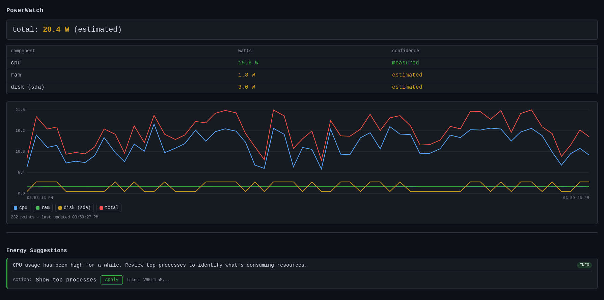
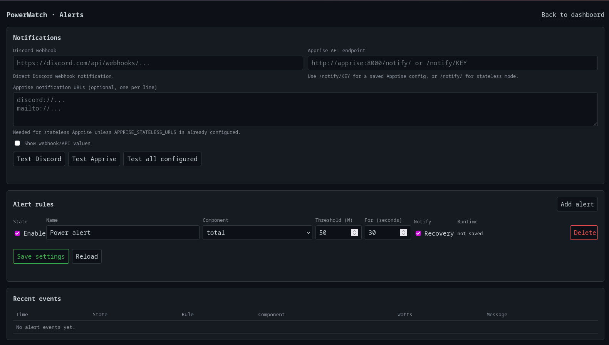
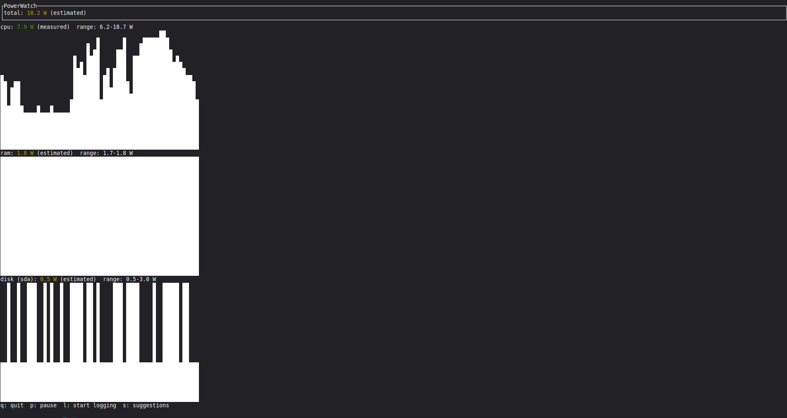

# PowerWatch

<p align="center">
  
</p>

<p align="center">
  <strong>Français</strong> · <a href="README.en.md">English</a>
</p>

**PowerWatch** surveille la consommation électrique d'une machine Linux depuis Docker et l'affiche dans une WebUI, avec historique, alertes et plusieurs sources matérielles réelles ou estimées.

Ce fork est pensé en priorité pour les **serveurs, mini-PC, machines desktop Linux et hôtes Docker**. Le déploiement documenté ici est **Docker uniquement**.

> **Sécurité :** la WebUI n'a pas d'authentification intégrée. Utilisez-la uniquement sur un **LAN privé de confiance**. Ne l'exposez pas directement sur Internet.

## Fonctionnalités

- WebUI temps réel avec vue historique.
- Historique SQLite persistant avec agrégation longue durée.
- Alertes configurables depuis la WebUI.
- Notifications **Discord** et **Apprise API**.
- Détection multi-GPU **NVIDIA / AMD / Intel**.
- Fallback **Intel RAPL `uncore`** pour certains iGPU sans compteur i915/xe hwmon.
- Suivi de tous les **disques physiques** sans double comptage RAID/LVM.
- Affichage best-effort des **partitions, montages, systèmes de fichiers, mdraid, LVM et dm-crypt** liés aux disques.
- CLI et TUI disponibles dans l'image Docker.
- Images GHCR multi-architecture **amd64 / arm64**.
- Interface Web **français / anglais**.

## Mesures

| Composant | Source | Type |
|---|---|---|
| CPU | RAPL Linux | Mesurée |
| GPU NVIDIA | NVML | Mesurée |
| GPU AMD | `amdgpu` hwmon | Mesurée |
| GPU Intel | `i915` / `xe` hwmon ou RAPL `uncore` | Mesurée |
| RAM | Heuristique | Estimée |
| Disques | Activité + type de disque | Estimée |
| Total | Somme des capteurs disponibles | Mixte |

Un capteur indisponible est simplement ignoré.

Sur certains Intel, PowerWatch peut utiliser le sous-domaine RAPL `uncore` comme mesure de l'iGPU. Dans ce cas, la valeur CPU est calculée à partir du package en retirant `uncore` afin de ne pas compter deux fois l'iGPU.

## Installation Docker

### Prérequis

- Linux ;
- Docker Engine ;
- Docker Compose ;
- accès en lecture à `/sys` depuis le conteneur ;
- pour NVIDIA : pilote NVIDIA + NVIDIA Container Toolkit sur l'hôte.

### Démarrage rapide

```bash
git clone https://github.com/Aerya/PowerWatch.git
cd PowerWatch

cp .env.example .env
docker compose pull
docker compose up -d
```

Par défaut, le Compose publie la WebUI uniquement sur :

```text
127.0.0.1:3000
```

Pour l'ouvrir sur le réseau local, modifiez `.env` avec **l'adresse IPv4 privée du serveur** :

```env
POWERWATCH_BIND_IP=192.168.0.50
```

Puis relancez :

```bash
docker compose up -d
```

La WebUI sera alors disponible sur :

```text
http://192.168.0.50:3000
```

Le fichier [`compose.yaml`](compose.yaml) fourni est le fichier de déploiement de référence.

Pour les détails matériels et Docker : [`DOCKER.md`](DOCKER.md).

## GPU

### AMD

Aucune configuration Docker supplémentaire n'est nécessaire. PowerWatch lit les compteurs Linux `amdgpu` exposés dans `/sys`.

### Intel

PowerWatch utilise en priorité les compteurs `i915` / `xe` disponibles dans `hwmon`.

Lorsqu'ils ne fournissent pas de télémétrie de puissance mais que RAPL expose un sous-domaine `uncore`, celui-ci peut être utilisé comme fallback `gpu:intel:0`.

### NVIDIA

Le pilote NVIDIA et **NVIDIA Container Toolkit** doivent être installés sur l'hôte.

Le bloc NVIDIA est déjà présent dans `compose.yaml`, mais commenté pour que le même fichier fonctionne aussi sur les machines sans NVIDIA. Décommentez les lignes NVIDIA indiquées dans le Compose puis redémarrez :

```bash
docker compose up -d
```

Plusieurs GPU et les machines mixtes AMD/Intel/NVIDIA sont supportés lorsque les compteurs correspondants sont lisibles.

## Disques, partitions et stockage

PowerWatch crée un capteur électrique uniquement pour chaque **disque physique**.

Les couches comme mdraid, LVM et dm-crypt ne sont pas ajoutées comme faux disques et ne sont donc pas comptées une seconde fois.

Quand Linux permet de reconstruire la relation, l'affichage peut par exemple devenir :

```text
disk (sda) — sda1 → md0 [RAID1] → vg-data/lv-media [LVM] → /mnt/data [ext4]

disk (nvme0n1) — nvme0n1p2 → cryptroot [dm-crypt] → / [ext4]
```

Une partition non montée peut également apparaître avec `[unmounted]`.

Les identifiants internes restent stables (`disk:sda`, `disk:nvme0n1`, etc.) afin de ne pas casser l'historique ni les alertes.

## WebUI

<p align="center">
  
</p>

La page principale affiche :

- la consommation totale ;
- chaque capteur détecté ;
- la distinction **mesurée / estimée** ;
- les historiques ;
- moyenne, minimum, maximum et énergie ;
- des périodes prédéfinies et personnalisables ;
- les libellés enrichis des disques ;
- le choix de langue FR / EN.

L'image Docker démarre automatiquement PowerWatch avec l'historique activé et le mode NAS/headless.

## Historique

Les données sont stockées dans SQLite dans le volume persistant `./data`.

Rétention actuelle :

- mesures brutes : **30 jours** ;
- agrégats 15 minutes : **de 30 jours à 1 an** ;
- agrégats 1 heure : **au-delà d'un an**.

Les longues périodes sont agrégées côté serveur afin d'éviter d'envoyer inutilement des milliers de points à la WebUI.

## Alertes et notifications

<p align="center">
  
</p>

La page `/alerts` permet de créer des règles persistantes sur :

- le total ;
- le CPU ;
- l'ensemble des GPU ;
- un GPU précis (`gpu:nvidia:0`, `gpu:amd:0`, `gpu:intel:0`, etc.) ;
- la RAM ;
- un disque précis.

Chaque règle peut définir :

- un seuil en watts ;
- une durée minimale de dépassement ;
- activation / désactivation ;
- notification de retour à la normale.

Notifications disponibles :

- **Discord** via webhook entrant ;
- **Apprise API**.

Les paramètres d'alertes sont conservés dans le volume persistant Docker avec l'historique.

## CLI et TUI dans Docker

La WebUI est le service principal, mais l'image contient également la CLI et la TUI.

### Snapshot

```bash
docker exec powerwatch powerwatch
```

### JSON

```bash
docker exec powerwatch powerwatch --json
```

### Historique CLI

```bash
docker exec powerwatch powerwatch history --since 1h
```

### TUI

<p align="center">
  
</p>

```bash
docker exec -it powerwatch powerwatch-tui
```

Lancer la CLI ou la TUI avec `docker exec` n'interrompt pas la WebUI.

## Vérifier les capteurs détectés

```bash
docker exec powerwatch powerwatch --json
```

Exemples d'identifiants GPU :

```text
gpu:nvidia:0
gpu:nvidia:1
gpu:amd:0
gpu:intel:0
```

Pour vérifier RAPL directement dans le conteneur :

```bash
docker exec powerwatch sh -c \
  'find /host-sys-virtual/powercap/intel-rapl -name energy_uj -o -name name 2>/dev/null'
```

## Données persistantes

Le Compose monte :

```text
./data → /data/.local/share/powerwatch
```

Ce répertoire contient notamment :

```text
history.db
alerts.json
```

Conservez `./data` lors des mises à jour du conteneur.

## Mise à jour

```bash
docker compose pull
docker compose up -d
docker image prune -f
```

## Sécurité

PowerWatch a besoin d'accéder à plusieurs informations matérielles de l'hôte pour mesurer les composants.

Le Compose fourni utilise notamment :

- `/sys` en lecture seule ;
- `/sys/devices/virtual` en lecture seule pour RAPL ;
- `pid: host` pour certaines informations hôte ;
- un système de fichiers conteneur en lecture seule ;
- `no-new-privileges:true`.

La WebUI ne possède actuellement **ni authentification ni HTTPS intégré**. Ne la publiez pas directement derrière un port-forward, un tunnel public ou un reverse proxy exposé à Internet sans protection d'accès supplémentaire.

## Plateforme supportée par ce fork

La documentation et les images publiées par ce fork ciblent **Linux + Docker**.

Le code historique de PowerWatch contient encore des éléments issus du projet original pour d'autres plateformes, mais **Windows et macOS ne font pas partie du périmètre supporté/documenté de ce fork**.

## Image Docker

Image :

```text
ghcr.io/aerya/powerwatch:latest
```

Architectures publiées :

```text
linux/amd64
linux/arm64
```

Les builds et images sont produits par **GitHub Actions**.

## Attribution

Ce dépôt est un fork maintenu par **Aerya**.

Projet original : [lnpotter/PowerWatch](https://github.com/lnpotter/PowerWatch)

Merci à son auteur pour la base du projet.

## Licence

Voir [`LICENSE`](LICENSE).
